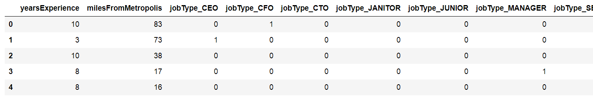
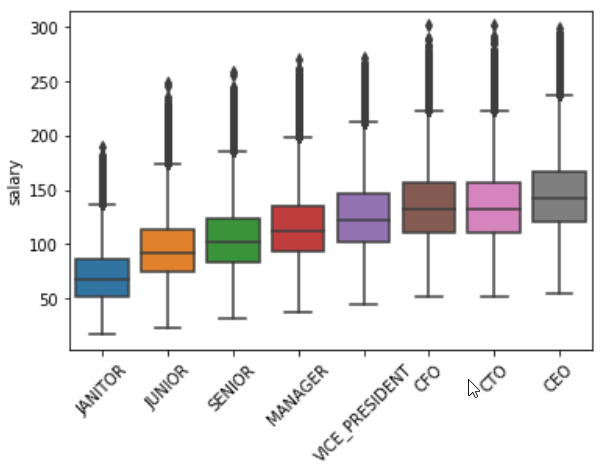
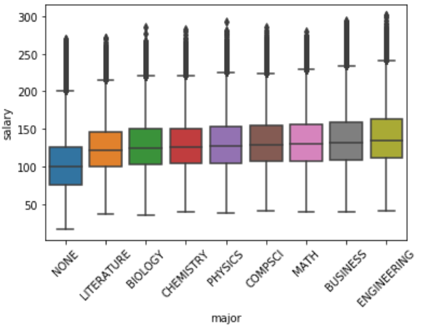
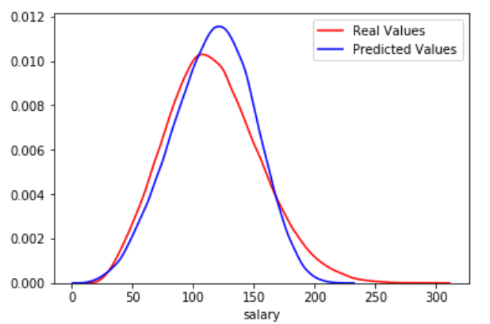
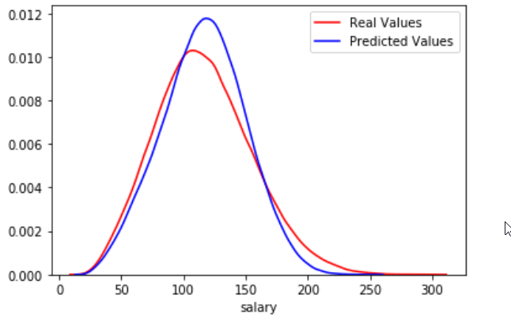
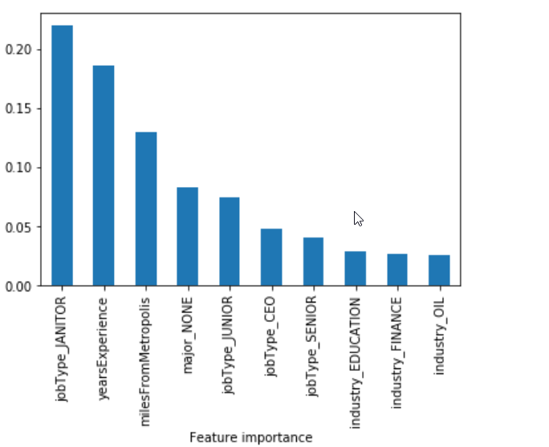

# Salary Prediction using Linear Regression and Gradient Boosting Regressor

## 📋 Table of Contents
- [Project Overview](#project-overview)
- [Problem Statement](#problem-statement)
- [Dataset Description](#dataset-description)
- [Technical Architecture](#technical-architecture)
- [Installation and Setup](#installation-and-setup)
- [Data Preprocessing](#data-preprocessing)
- [Feature Engineering](#feature-engineering)
- [Model Development](#model-development)
- [Results and Evaluation](#results-and-evaluation)
- [Feature Importance Analysis](#feature-importance-analysis)
- [Model Performance Comparison](#model-performance-comparison)
- [Usage Instructions](#usage-instructions)
- [Future Improvements](#future-improvements)
- [Contributing](#contributing)
- [License](#license)

## 🎯 Project Overview

This project implements a machine learning solution for salary prediction using two different algorithms: Linear Regression and Gradient Boosting Regressor. The goal is to predict employee salaries based on various features such as job type, experience, education, industry, and location.

### Key Features
- **Dual Model Approach**: Compares Linear Regression vs Gradient Boosting Regressor
- **Comprehensive EDA**: Extensive exploratory data analysis with visualizations
- **Feature Engineering**: One-hot encoding for categorical variables
- **Model Evaluation**: Cross-validation and MSE-based performance assessment
- **Feature Importance**: Analysis of feature contributions to predictions

## 🎯 Problem Statement

**Objective**: Predict employee salaries based on multiple features including job characteristics, experience, education, and location.

**Business Value**: 
- Help companies set competitive salary ranges
- Assist job seekers in salary negotiations
- Provide insights into salary determinants across industries

## 📊 Dataset Description

### Data Structure
- **Training Data**: 1,000,000 observations with 7 features + 1 target variable
- **Test Data**: Separate test set for final predictions
- **Data Quality**: Clean dataset with no missing values

### Features
| Feature | Type | Description |
|---------|------|-------------|
| `jobId` | Object | Unique job identifier |
| `companyId` | Object | Company identifier |
| `jobType` | Categorical | Type of job (e.g., CEO, CFO, etc.) |
| `degree` | Categorical | Educational degree level |
| `major` | Categorical | Field of study |
| `industry` | Categorical | Industry sector |
| `yearsExperience` | Numerical | Years of work experience |
| `milesFromMetropolis` | Numerical | Distance from major city |

### Target Variable
- `salary`: Annual salary in currency units

### Data Distribution


## 🏗️ Technical Architecture

### Technology Stack
- **Python 3.8+**: Core programming language
- **Pandas**: Data manipulation and analysis
- **NumPy**: Numerical computations
- **Scikit-learn**: Machine learning algorithms
- **Matplotlib/Seaborn**: Data visualization
- **Jupyter Notebook**: Interactive development environment

### Project Structure
```
salary-prediction--LNR-GBR/
├── data/                          # Dataset files
│   ├── train_features.csv         # Training features
│   ├── train_salaries.csv         # Training targets
│   └── test_features.csv          # Test features
├── pictures/                      # Generated visualizations
├── salary_pred.ipynb             # Main analysis notebook
├── requirements.txt              # Python dependencies
└── README.md                     # Project documentation
```

## 🚀 Installation and Setup

### Prerequisites
- Python 3.8 or higher
- pip package manager

### Installation Steps

1. **Clone the repository**
   ```bash
   git clone https://github.com/manoharpavuluri/salary-prediction--LNR-GBR.git
   cd salary-prediction--LNR-GBR
   ```

2. **Create virtual environment (recommended)**
   ```bash
   python -m venv venv
   source venv/bin/activate  # On Windows: venv\Scripts\activate
   ```

3. **Install dependencies**
   ```bash
   pip install -r requirements.txt
   ```

4. **Launch Jupyter Notebook**
   ```bash
   jupyter notebook
   ```

5. **Open the analysis notebook**
   - Navigate to `salary_pred.ipynb`
   - Run all cells to reproduce the analysis

## 🔧 Data Preprocessing

### Data Cleaning Steps
1. **Null Value Check**: Verified no missing values in the dataset
2. **Data Type Validation**: Confirmed numerical columns are properly typed
3. **Outlier Removal**: Removed records with zero salaries (data quality issue)
4. **Data Merging**: Combined features and target datasets on `jobId`

### Data Quality Assessment
- **Dataset Size**: 1,000,000 records after cleaning
- **Memory Usage**: ~76.3 MB
- **Data Types**: 3 numerical, 6 categorical features

## 🔍 Feature Engineering

### One-Hot Encoding
Applied one-hot encoding to categorical variables to convert them into numerical format suitable for machine learning algorithms.



### Feature Selection
Based on correlation analysis, `companyId` was excluded as it showed minimal correlation with salary.

### Correlation Analysis
- **Years of Experience**: Strong positive correlation with salary
- **Miles from Metropolis**: Negative correlation (closer to city = higher salary)
- **Job Type, Degree, Major, Industry**: Moderate correlations


### Categorical Feature Analysis
Visual analysis of salary distributions across categorical features:






## 🤖 Model Development

### Model Selection
Two algorithms were implemented and compared:

1. **Linear Regression**: Baseline model for comparison
2. **Gradient Boosting Regressor**: Advanced ensemble method

### Training Process
- **Train-Test Split**: 75% training, 25% testing
- **Cross-Validation**: 2-fold cross-validation for model evaluation
- **Random State**: Fixed at 42 for reproducibility

### Model Parameters

#### Linear Regression
- Default parameters from scikit-learn
- No hyperparameter tuning required

#### Gradient Boosting Regressor
- `n_estimators`: 150 (number of boosting stages)
- `max_depth`: 5 (maximum depth of decision trees)
- `learning_rate`: 0.1 (default)
- `loss`: 'ls' (least squares)

## 📈 Results and Evaluation

### Model Performance Metrics

| Model | Mean Squared Error (MSE) | Standard Deviation |
|-------|-------------------------|-------------------|
| Linear Regression | 384.37 | 0.92 |
| Gradient Boosting Regressor | 357.57 | 0.33 |

### Model Comparison

#### Linear Regression Results



#### Gradient Boosting Regressor Results



### Key Findings
- **GBR outperforms Linear Regression** with lower MSE (357.57 vs 384.37)
- **GBR shows better consistency** with lower standard deviation
- **Both models capture salary distribution patterns** effectively

## 🎯 Feature Importance Analysis

Gradient Boosting Regressor provides feature importance scores:



### Top Influential Features
1. **Job Type**: Most significant predictor of salary
2. **Years of Experience**: Strong positive correlation
3. **Industry**: Moderate influence
4. **Degree Level**: Educational impact on salary
5. **Major**: Field of study relevance

## 📊 Model Performance Comparison

### Advantages of Each Model

#### Linear Regression
- ✅ **Interpretability**: Clear coefficient interpretation
- ✅ **Speed**: Fast training and prediction
- ✅ **Simplicity**: Easy to understand and implement
- ❌ **Limited Complexity**: Cannot capture non-linear relationships

#### Gradient Boosting Regressor
- ✅ **Higher Accuracy**: Better prediction performance
- ✅ **Non-linear Relationships**: Captures complex patterns
- ✅ **Feature Importance**: Provides feature ranking
- ❌ **Complexity**: Harder to interpret
- ❌ **Computational Cost**: Slower training time

## 🚀 Usage Instructions

### Running the Analysis

1. **Execute the Notebook**
   ```bash
   jupyter notebook salary_pred.ipynb
   ```

2. **Follow the Analysis Flow**
   - Data loading and exploration
   - Feature engineering
   - Model training and evaluation
   - Results visualization

3. **Generate Predictions**
   - The notebook includes code for making predictions on test data
   - Final predictions are saved with the original test features

### Making New Predictions

```python
# Load the trained model
import joblib
model = joblib.load('gbr_model.pkl')

# Prepare new data (apply same preprocessing)
# One-hot encode categorical features
# Make predictions
predictions = model.predict(new_data)
```

## 🔮 Future Improvements

### Model Enhancements
1. **Hyperparameter Tuning**
   - Implement GridSearchCV or RandomizedSearchCV
   - Optimize GBR parameters (n_estimators, max_depth, learning_rate)
   - Add early stopping to prevent overfitting

2. **Advanced Algorithms**
   - **XGBoost**: Enhanced gradient boosting implementation
   - **LightGBM**: Light gradient boosting machine
   - **Neural Networks**: Deep learning approach for complex patterns
   - **Ensemble Methods**: Stacking multiple models

3. **Feature Engineering**
   - **Feature Interactions**: Create interaction terms between features
   - **Polynomial Features**: Add non-linear transformations
   - **Feature Scaling**: Standardize numerical features
   - **Target Encoding**: Alternative to one-hot encoding for high-cardinality features

### Data Improvements
1. **Additional Features**
   - Market conditions and economic indicators
   - Company size and revenue
   - Geographic cost of living indices
   - Skills and certifications
   - Performance metrics

2. **Data Quality**
   - Handle outliers more sophisticatedly
   - Implement data validation pipelines
   - Add data versioning and tracking

### Technical Improvements
1. **Production Deployment**
   - **API Development**: RESTful API for predictions
   - **Model Serving**: FastAPI or Flask implementation
   - **Containerization**: Docker deployment
   - **CI/CD Pipeline**: Automated testing and deployment

2. **Monitoring and Maintenance**
   - **Model Monitoring**: Track prediction drift
   - **Performance Metrics**: Real-time accuracy monitoring
   - **A/B Testing**: Compare model versions
   - **Retraining Pipeline**: Automated model updates

3. **Scalability**
   - **Distributed Computing**: Spark or Dask for large datasets
   - **Cloud Deployment**: AWS, Azure, or GCP integration
   - **Microservices**: Modular architecture

### User Experience
1. **Interactive Dashboard**
   - **Streamlit/Plotly**: Web-based interface
   - **Real-time Predictions**: Instant salary estimates
   - **What-if Analysis**: Explore different scenarios

2. **Documentation and Education**
   - **Model Cards**: Detailed model documentation
   - **Tutorial Videos**: Step-by-step guides
   - **Interactive Tutorials**: Jupyter notebooks with explanations

### Business Applications
1. **Industry-Specific Models**
   - **Sector-Specific Models**: Finance, tech, healthcare
   - **Geographic Models**: Regional salary variations
   - **Role-Specific Models**: Executive vs entry-level

2. **Advanced Analytics**
   - **Salary Gap Analysis**: Identify pay disparities
   - **Market Intelligence**: Competitive salary insights
   - **Talent Acquisition**: Optimize hiring strategies

## 🤝 Contributing

We welcome contributions! Please follow these steps:

1. Fork the repository
2. Create a feature branch (`git checkout -b feature/AmazingFeature`)
3. Commit your changes (`git commit -m 'Add some AmazingFeature'`)
4. Push to the branch (`git push origin feature/AmazingFeature`)
5. Open a Pull Request

### Contribution Guidelines
- Follow PEP 8 style guidelines
- Add tests for new functionality
- Update documentation for new features
- Ensure all tests pass before submitting

## 📄 License

This project is licensed under the MIT License - see the [LICENSE](LICENSE) file for details.

## 📞 Contact

For questions or support, please open an issue on GitHub or contact the maintainers.

---

**Note**: This project is for educational and research purposes. The models and predictions should not be used as the sole basis for salary decisions without additional validation and context.
